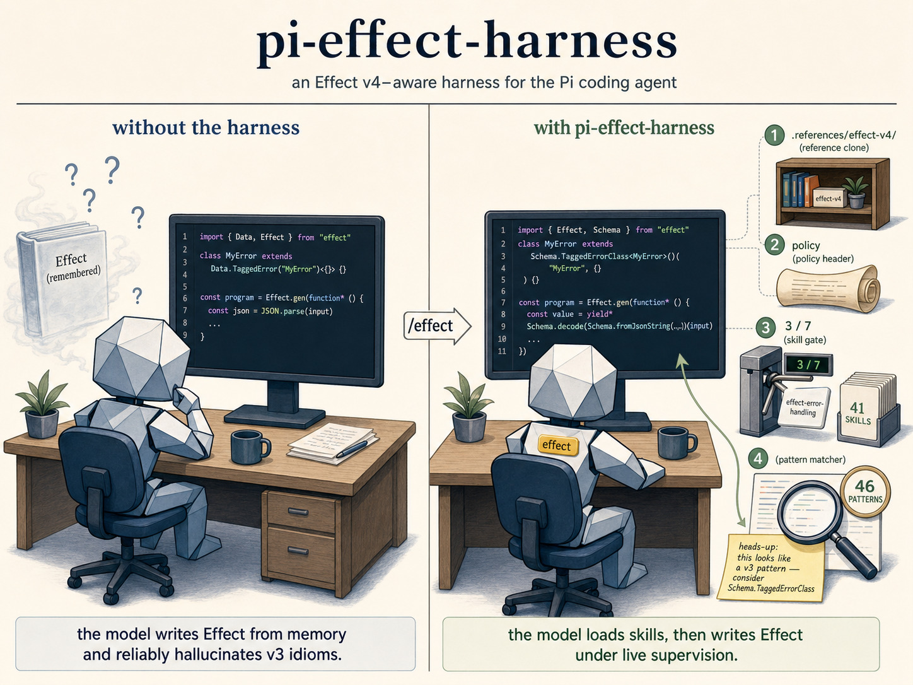

## Table of contents

- [What it does](#what-it-does)
- [Install](#install)
- [Usage](#usage)
- [How it works](#how-it-works)
  - [Lifecycle](#lifecycle)
  - [The skill gate](#the-skill-gate)
  - [The policy header](#the-policy-header)
  - [The pattern feedback loop](#the-pattern-feedback-loop)
  - [The reference clone](#the-reference-clone)
- [Skill catalog](#skill-catalog) (41)
- [Pattern catalog](#pattern-catalog) (46)
- [Configuration](#configuration)
- [Caveats](#caveats)
- [Development](#development)
- [License](#license)

---

## What it does

When `/effect` mode is enabled in the active Pi session:

- A gold `effect` badge appears in the Pi footer; mode state persists per-project.
- The system prompt is augmented every turn with `effect-first-development.md` (40+ rules covering errors, schemas, layers, services, retries, timeouts, structured concurrency, and observability), a progressive-disclosure agent rules doc, and a "loaded *N*/7 effect-\* skills on this branch" preview.
- Tool calls that would write Effect code are **blocked** until at least 7 `effect-*` skills have been read on the active branch. The check uses a prospective write projection, so removing or refactoring Effect code never trips it.
- After every successful write, the post-write file is matched against 46 pattern detectors. Matches are sorted by severity and replied back to the agent in-band as a single user message — including the pattern's transformation guidance and a hint to load any suggested skills.
- A shallow clone of [`Effect-TS/effect-smol`](https://github.com/Effect-TS/effect-smol) is maintained at `.references/effect-v4/`, pinned to the tag matching your project's installed `effect` version. The agent reads from it to verify v4 APIs instead of guessing.

Everything else about your Pi session is unchanged. Toggle `/effect` off and the harness disengages cleanly — the system prompt reverts on the next turn, the gate stops firing, and the pattern loop stops emitting feedback.

---

## Install

```bash
pi install npm:pi-effect-harness
```

This registers the extension and all 41 `effect-*` skills via the package's `pi` manifest. Pi auto-loads on the next session start.

The first time you enable `/effect` in a project, the harness clones `effect-smol` at the tag matching your installed `effect` version into `.references/effect-v4/` (≈30s, shallow, fail-silent). Add to your project's `.gitignore`:

```gitignore
.references/
```

**Peer requirement:** `@mariozechner/pi-coding-agent` (any version). The harness depends on `effect@4.0.0-beta.59` and `@effect/platform-node` from npm.

---

## Usage

| | |
|---|---|
| Toggle | `/effect` (interactive), or via Pi's mode toggle UI |
| Status | Gold `effect` badge in the footer |
| Persistence | Project (`.pi/` under cwd); survives session restart |
| Activation cost | First time per project: shallow clone of `effect-smol` |
| Per-turn cost | ~3 KB of system-prompt headers + the merged guidance docs |

When mode is off, this extension does nothing — no rules fire, no hooks emit decisions, no system prompt is injected.

---

## How it works

The harness is a thin shell around an [Effect](https://effect.website) `ManagedRuntime`. Pi events are forwarded to a `HarnessController`, which fans them out to a `RuleSet` and a `HookSet`. Rules return `Decision` values; a `DecisionExecutor` translates those decisions back into Pi `ExtensionAPI` calls.

### Lifecycle

```
session_start ─► restore mode state · rebuild SkillCatalog · refresh EffectVersion · ensure ReferenceClone

before_agent_start
  ├─► RuleSet
  │     └─► InjectEffectPolicyHeader
  │           └─► Decision.InjectSystemPrompt

tool_call (Read/Edit/Write)
  ├─► HookSet
  │     └─► TrackSkillRead
  │           └─► PendingSkillReads.remember(toolCallId, skillName)
  └─► RuleSet
        └─► RequireLoadedSkillsForEffectWrites
              ├─► WriteProjection.prospective(cwd, writeIntent)
              └─► Decision.BlockToolCall  (if Effect code present and skills < 7)

tool_result
  ├─► HookSet
  │     └─► EmitSkillLoadedEntry
  │           └─► Decision.AppendCustomEntry
  │                 (customType: "pi-effect-harness:skill-loaded")
  └─► RuleSet
        └─► SendPatternFeedbackAfterWrite
              ├─► WriteProjection.actual(cwd, writeIntent)
              ├─► PatternMatcher × 46 patterns
              └─► Decision.InjectUserMessage
```

Three rules. Two write-side hooks. Everything that touches Pi runs through `Decision` — there is no direct mutation of session state from rule code, which keeps the rules trivially testable in isolation.

### The skill gate

Effect v4 is wide. A model writing Effect cold — without any in-context skill — will reliably produce v3 patterns: `Effect.catchAll`, `Schema.parseJson`, `Data.TaggedError`, `OptionFromSelf`, `compose(...)` instead of `decodeTo(...)`, untraced `Effect.gen` everywhere. The skill gate exists to make the agent stop and read before writing.

**What counts as a skill.** Each subdirectory under `skills/` has a `SKILL.md` with frontmatter. Pi exposes these as `/skill:effect-error-handling` commands. The harness watches every Read tool call: when the read path resolves to a known `effect-*` skill (matched against the live skill catalog), it remembers the pending read keyed by `toolCallId`. On `tool_result`, if the read succeeded, it appends a `Decision.AppendCustomEntry` with `customType: "pi-effect-harness:skill-loaded"` and `data: { name, path }` to the active branch.

**What "loaded" means.** Loaded-skill state is derived, not stored. The `activeBranchLoadedEffectSkills` atom scans the current branch's entries for those custom entries and returns the resulting `ReadonlySet<string>`. This means:

- `/compact`, `/fork`, and `/clone` reset the count by default — re-loading skills after a context reset is a feature, not a bug.
- The count is monotonic *within* a branch.
- Counting pending reads in addition to confirmed loads avoids a race where the gate fires between the Read tool call and its result.

**The threshold.** `MIN_EFFECT_SKILLS = 7`. Schema, Error Handling, and Layers cover ~70% of any Effect codebase; the remaining four should be task-relevant (AI, SQL, HTTP, CLI, RPC, Workflow, Stream, Testing, Observability, etc.). Seven is calibrated, not arbitrary — fewer and the model still hallucinates; more and the activation friction outweighs the benefit.

**Why prospective projection matters.** The gate runs on `WriteProjection.prospective(cwd, writeIntent)`, which reconstructs *what the file will look like after the write/edit applies*. A diff that removes Effect code does not match `\bEffect\b|from\s+['"]effect.*['"]` and is allowed through. A diff that adds Effect code is gated. This means refactors that *delete* Effect-specific code can proceed without artificially incrementing the skill counter.

**The block message** quotes the loaded count, the missing count, and a hint to read from `.references/effect-v4/` if any API is unclear. The agent retries after loading more skills.

### The policy header

Every turn while mode is enabled, `InjectEffectPolicyHeader` emits a `Decision.InjectSystemPrompt` whose content is the merged contents of `harnesses/effect/guidance/`:

| File | Contents |
|---|---|
| `effect-first-development.md` | The full Effect-first specification: 40+ numbered laws (EF-1 … EF-40) covering tagged errors, `Option`, schema, canonical imports, `Match`, services & layers, `Clock`, observability, `Duration`, JSON via `Schema`, scoped resources, retries, timeouts, structured concurrency, parallel concurrency, `Config`, `Redacted`, defects vs. failures, layer memoization isolation, schema-first domain modeling, schema defaults, branded guards, equivalence, transformations, native sort, dual APIs. Followed by copy-paste templates and a 45-item LLM review checklist. |
| `progressive-disclosure-guidance.md` | Short, imperative agent rules: "load AT LEAST 7 effect-\* skills before any Effect work; if anything is unclear, read from `.references/effect-v4/`." |
| `post__effect-and-the-near-inexpressible-majesty-of-layers.md` | A long-form essay defending Effect's `Layer` type. Included for the same reason a system prompt cites a style guide: priors matter. |

Followed by a runtime line:

```
pi-effect-harness policy:
- Before planning or writing Effect code, read at least 7 relevant effect-* skills.
  Loaded on this branch: 3/7 (effect-error-handling, effect-layer-design, effect-schema-v4).
- If any Effect v4 API is unclear, read from the local Effect reference clone instead of guessing.
- Key reference paths: .references/effect-v4/LLMS.md, .references/effect-v4/MIGRATION.md,
  .references/effect-v4/packages/effect/SCHEMA.md, .references/effect-v4/packages/effect/HTTPAPI.md,
  .references/effect-v4/packages/effect/src/.
```

The skill preview is sorted, capped at 7 names, with `(+N more)` for overflow. The full guidance is loaded once at layer construction and re-emitted from memory each turn.

### The pattern feedback loop

After a successful write, every pattern under `patterns/` is matched against the actual post-write file via `PatternMatcher`. Each pattern is a markdown file with YAML frontmatter:

```yaml
---
action: context
tool: (edit|write)
event: after
name: avoid-data-tagged-error
description: Use Schema.TaggedErrorClass instead of Data.TaggedError for serialization and RPC compatibility
glob: '**/*.{ts,tsx}'
detector: ast
pattern: Data.TaggedError($$$)
level: warning
suggestSkills:
    - effect-error-handling
---

# Use `Schema.TaggedErrorClass` Instead of `Data.TaggedError`
…
```

Detectors are either ast-grep rules (single pattern, list of patterns, or full rule object with `inside` / `constraints`) or regex with comment-skipping. Severity levels are `critical`, `high`, `medium`, `warning`, `info`. Matches are de-duplicated, sorted by severity, and emitted as a single `Decision.InjectUserMessage`:

```
pi-effect-harness review request:
File: `src/services/MyThing.ts`

I noticed potential Effect-pattern issues in the write you just completed.
Please inspect this change now.
If the warning is valid, revise the code before continuing.
If you believe it is a false positive or an intentional exception, briefly say so and continue.

Matched patterns:
- avoid-data-tagged-error [warning]: Use Schema.TaggedErrorClass instead of Data.TaggedError…

Relevant guidance:
## avoid-data-tagged-error
…(the full body of the pattern's markdown, plus suggested skills hints)…
```

The pattern bodies use a Haskell-style transformation diagram convention — type signatures for the bad and good forms, then a one-paragraph rationale. This is harness-internal style, not a requirement; you can fork the patterns and use whatever rationale format you prefer.

The `suggestedSkills` field is appended to the matched-pattern feedback as: *"If you have not loaded the `effect-error-handling` skill, you should load it before continuing."* This closes the feedback loop: a pattern miss surfaces both the rule and the skill that documents it.

### The reference clone

Effect v4 is moving fast. Beta releases ship with API renames in nearly every minor (`catchAll → catch`, `parseJson → fromJsonString`, `Either → Result`, `compose → decodeTo`, the entire `*FromSelf` suffix removal, etc.). The most reliable way to keep an agent honest is to give it the source.

On the first `tool_call` in `/effect` mode, `EnsureReferenceClone` runs `git clone --depth 1 --branch effect@<version>` of `Effect-TS/effect-smol` into `.references/effect-v4.cloning/`, writes a `.pi-effect-harness-version` marker file, and atomically renames into place. The version is detected by reading `node_modules/effect/package.json` (falling back to `4.0.0-beta.59` if absent).

Properties:

- **Atomic**: the clone happens in a temp directory and is `rename()`-d into place. Either `.references/effect-v4/` is present and complete, or it is absent.
- **Idempotent**: a marker file (`.pi-effect-harness-version`) records the cloned tag. If the marker matches the installed version, the clone is skipped. If it mismatches, the stale clone is removed and re-cloned.
- **Single-flight**: a module-level `clonePromise` deduplicates concurrent invocations across hooks.
- **Fail-silent**: a clone failure (no network, missing tag, git not on PATH) never blocks the agent. The harness continues without the reference; the policy header still tells the agent the paths to look for.

The agent doesn't have to know any of this. It sees `.references/effect-v4/LLMS.md` and `.references/effect-v4/packages/effect/SCHEMA.md` mentioned in the policy header, and reads them like any other file.

---

## Skill catalog

41 skills, all loaded into Pi's `/skill:` namespace.

### AI / LLM (6)

| Skill | Description |
|---|---|
| [`effect-ai-chat`](./harnesses/effect/skills/effect-ai-chat/SKILL.md) | Stateful AI chat sessions with the Effect Chat module — multi-turn conversations, agentic tool-calling loops, persistence, streaming, structured object generation. |
| [`effect-ai-language-model`](./harnesses/effect/skills/effect-ai-language-model/SKILL.md) | The Effect AI `LanguageModel` service — text generation, structured output, streaming, tool calling, schema-validated responses. |
| [`effect-ai-prompt`](./harnesses/effect/skills/effect-ai-prompt/SKILL.md) | The complete Prompt API for constructing, merging, and manipulating LLM conversations using messages, parts, and composition operators. |
| [`effect-ai-provider`](./harnesses/effect/skills/effect-ai-provider/SKILL.md) | `@effect/ai` provider layers (Anthropic, OpenAI, OpenAI-Compat, OpenRouter) with config management, model abstraction, `ExecutionPlan` fallback, runtime overrides. |
| [`effect-ai-streaming`](./harnesses/effect/skills/effect-ai-streaming/SKILL.md) | Streaming response patterns: start/delta/end protocol, accumulation strategies, resource-safe consumption, history management with `SubscriptionRef`. |
| [`effect-ai-tool`](./harnesses/effect/skills/effect-ai-tool/SKILL.md) | Tool and Toolkit APIs — type-safe tool definitions, parameter validation, handler implementations, user- and provider-defined tools. |

### Schema & domain modeling (8)

| Skill | Description |
|---|---|
| [`effect-schema-v4`](./harnesses/effect/skills/effect-schema-v4/SKILL.md) | Authoritative reference for Effect Schema v4 API changes and v3 → v4 migration. Find-and-replace tables, breaking changes, idiom shifts. |
| [`effect-schema-composition`](./harnesses/effect/skills/effect-schema-composition/SKILL.md) | `Schema.decodeTo`, transformations, filters, multi-stage validation. |
| [`effect-domain-modeling`](./harnesses/effect/skills/effect-domain-modeling/SKILL.md) | Production-ready domain models with `Schema.TaggedStruct` — ADTs, predicates, orders, guards, match functions. |
| [`effect-domain-predicates`](./harnesses/effect/skills/effect-domain-predicates/SKILL.md) | Comprehensive predicates and orders for domain types using typeclass patterns. |
| [`effect-typeclass-design`](./harnesses/effect/skills/effect-typeclass-design/SKILL.md) | Curried signatures and dual data-first / data-last APIs. |
| [`effect-pattern-matching`](./harnesses/effect/skills/effect-pattern-matching/SKILL.md) | `Data.TaggedEnum`, `$match`, `$is`, `Match.typeTags`, `Effect.match`. Avoid manual `_tag` checks. |
| [`effect-context-witness`](./harnesses/effect/skills/effect-context-witness/SKILL.md) | When to use `Context.Service` witness vs. capability patterns; coupling trade-offs. |
| [`effect-optics`](./harnesses/effect/skills/effect-optics/SKILL.md) | `Iso`, `Lens`, `Prism`, `Optional`, `Traversal` — composable, type-safe access and immutable updates to nested data. |

### Layers, services, runtime (5)

| Skill | Description |
|---|---|
| [`effect-layer-design`](./harnesses/effect/skills/effect-layer-design/SKILL.md) | Designing and composing layers for clean dependency management. |
| [`effect-service-implementation`](./harnesses/effect/skills/effect-service-implementation/SKILL.md) | Fine-grained service capabilities; avoiding monolithic designs. |
| [`effect-managed-runtime`](./harnesses/effect/skills/effect-managed-runtime/SKILL.md) | Bridging Effect into non-Effect frameworks (Hono, Express, Fastify, Lambda, Workers) via `ManagedRuntime`. |
| [`effect-platform-abstraction`](./harnesses/effect/skills/effect-platform-abstraction/SKILL.md) | Cross-platform file I/O, process spawning, HTTP clients, terminal — the abstraction itself. |
| [`effect-platform-layers`](./harnesses/effect/skills/effect-platform-layers/SKILL.md) | Structuring platform-layer provision for cross-platform applications. |

### Errors, config, observability (4)

| Skill | Description |
|---|---|
| [`effect-error-handling`](./harnesses/effect/skills/effect-error-handling/SKILL.md) | `Schema.TaggedErrorClass`, `catchTag`/`catchTags`, `catchReason`/`catchReasons`, `Cause`, `ErrorReporter`, recovery patterns. |
| [`effect-config`](./harnesses/effect/skills/effect-config/SKILL.md) | `Config` and `ConfigProvider` — env vars, structured config, test config, `.env`, JSON, custom sources. |
| [`effect-observability`](./harnesses/effect/skills/effect-observability/SKILL.md) | Structured logging, distributed tracing, metrics; OTLP/Prometheus export. |
| [`effect-wide-events`](./harnesses/effect/skills/effect-wide-events/SKILL.md) | Wide events (canonical log lines) for observability. Conceptual guide for instrumentation strategy. |

### Data, IO, concurrency (7)

| Skill | Description |
|---|---|
| [`effect-stream`](./harnesses/effect/skills/effect-stream/SKILL.md) | Pull-based streaming pipelines — creation, transformation, consumption, encoding (NDJSON/Msgpack), concurrency, resource safety. |
| [`effect-batching`](./harnesses/effect/skills/effect-batching/SKILL.md) | `Request`, `RequestResolver`, `SqlResolver` — N+1 elimination, batched data-fetching layers, request caching. |
| [`effect-pubsub-event-bus`](./harnesses/effect/skills/effect-pubsub-event-bus/SKILL.md) | Typed event buses with `PubSub` and `Stream`. |
| [`effect-filesystem`](./harnesses/effect/skills/effect-filesystem/SKILL.md) | Cross-platform file I/O across Node.js, Bun, browser. |
| [`effect-path`](./harnesses/effect/skills/effect-path/SKILL.md) | Cross-platform path operations — joining, resolving, URL conversion. |
| [`effect-command-executor`](./harnesses/effect/skills/effect-command-executor/SKILL.md) | `ChildProcess` — shell commands, captured output, piping, streaming, scoped lifecycle. |
| [`effect-concurrency-testing`](./harnesses/effect/skills/effect-concurrency-testing/SKILL.md) | Testing `PubSub`, `Deferred`, `Latch`, `Fiber`, `SubscriptionRef`, `Stream`. |

### Persistence & networking (4)

| Skill | Description |
|---|---|
| [`effect-sql`](./harnesses/effect/skills/effect-sql/SKILL.md) | `SqlClient`, `SqlSchema`, `SqlModel` (CRUD repos), `SqlResolver`, `Migrator`. |
| [`effect-http-api`](./harnesses/effect/skills/effect-http-api/SKILL.md) | `HttpApi`, `HttpApiClient`, `HttpApiBuilder` — typed endpoints, security middleware, OpenAPI, derived clients. |
| [`effect-rpc-cluster`](./harnesses/effect/skills/effect-rpc-cluster/SKILL.md) | RPC endpoints, cluster routing, workflow patterns with Effect RPC and Cluster. |
| [`effect-workflow`](./harnesses/effect/skills/effect-workflow/SKILL.md) | Durable workflows with `Workflow`, `Activity`, `DurableClock`, `DurableDeferred` — execution that survives restarts, compensation (saga), distribution via Cluster. |

### CLI & MCP (2)

| Skill | Description |
|---|---|
| [`effect-cli`](./harnesses/effect/skills/effect-cli/SKILL.md) | Type-safe CLI applications — argument parsing, options, commands, dependency injection. |
| [`effect-mcp-server`](./harnesses/effect/skills/effect-mcp-server/SKILL.md) | MCP servers with `McpServer`, `McpSchema`, `Tool`, `Toolkit`; stdio and HTTP transports. |

### Testing & migration (2)

| Skill | Description |
|---|---|
| [`effect-testing`](./harnesses/effect/skills/effect-testing/SKILL.md) | `@effect/vitest` and `it.effect(...)` — services, layers, time-dependent effects, error handling, property-based testing. |
| [`effect-incremental-migration`](./harnesses/effect/skills/effect-incremental-migration/SKILL.md) | Migrating async/Promise-based modules to Effect services while preserving backward compatibility. |

### React (3)

| Skill | Description |
|---|---|
| [`effect-atom-state`](./harnesses/effect/skills/effect-atom-state/SKILL.md) | Reactive state management with Effect Atom for React applications. |
| [`effect-react-composition`](./harnesses/effect/skills/effect-react-composition/SKILL.md) | Composable React components using Effect Atom; avoiding boolean props; integrating with Effect's reactive state. |
| [`effect-react-vm`](./harnesses/effect/skills/effect-react-vm/SKILL.md) | The VM (View Model) pattern for reactive, testable frontend state management. |

---

## Pattern catalog

46 patterns. All match against `**/*.{ts,tsx}`, on `(edit|write)` tool calls, on the `after` event. Detectors are `ast` (ast-grep) unless noted.

### `avoid-*` (21)

| Pattern | Level | Description |
|---|---|---|
| [`avoid-any`](./harnesses/effect/patterns/avoid-any.md) | warning | `as any` and `as unknown` type assertions. |
| [`avoid-data-tagged-error`](./harnesses/effect/patterns/avoid-data-tagged-error.md) | warning | `Data.TaggedError` — use `Schema.TaggedErrorClass` for serialization and RPC compatibility. |
| [`avoid-direct-json`](./harnesses/effect/patterns/avoid-direct-json.md) | info | `JSON.parse` / `JSON.stringify` — use `Schema.fromJsonString` or `Schema.UnknownFromJsonString`. |
| [`avoid-direct-tag-checks`](./harnesses/effect/patterns/avoid-direct-tag-checks.md) | warning | Direct `_tag` property checks; use exported refinements/predicates. |
| [`avoid-expect-in-if`](./harnesses/effect/patterns/avoid-expect-in-if.md) | warning | `expect()` calls nested inside `if` blocks in tests. |
| [`avoid-fs-promises`](./harnesses/effect/patterns/avoid-fs-promises.md) | warning | `fs/promises` direct usage — wrap with Effect. |
| [`avoid-mutable-state`](./harnesses/effect/patterns/avoid-mutable-state.md) | info | `let` bindings inside Effect services; prefer `Ref`. |
| [`avoid-native-fetch`](./harnesses/effect/patterns/avoid-native-fetch.md) | warning | Native `fetch` — use Effect HTTP modules. |
| [`avoid-node-imports`](./harnesses/effect/patterns/avoid-node-imports.md) | warning | `node:` imports — use `@effect/platform` abstractions. |
| [`avoid-non-null-assertion`](./harnesses/effect/patterns/avoid-non-null-assertion.md) | warning | `!` non-null assertion operator. |
| [`avoid-object-type`](./harnesses/effect/patterns/avoid-object-type.md) | warning | `Object` and `{}` as types. |
| [`avoid-option-getorthrow`](./harnesses/effect/patterns/avoid-option-getorthrow.md) | warning | `Option.getOrThrow` — use `Option.match` or `Option.getOrElse`. |
| [`avoid-platform-coupling`](./harnesses/effect/patterns/avoid-platform-coupling.md) | warning | Binding packages importing platform-specific packages like `@effect/platform-bun`. |
| [`avoid-process-env`](./harnesses/effect/patterns/avoid-process-env.md) | warning | `process.env` — use `Config.*`. |
| [`avoid-react-hooks`](./harnesses/effect/patterns/avoid-react-hooks.md) | high | `useState`/`useEffect`/`useReducer` etc. — use VMs with Effect Atom. |
| [`avoid-schema-suffix`](./harnesses/effect/patterns/avoid-schema-suffix.md) | info | Schema constants suffixed with `Schema`; name them after the domain type. |
| [`avoid-sync-fs`](./harnesses/effect/patterns/avoid-sync-fs.md) | high | Synchronous filesystem operations. |
| [`avoid-try-catch`](./harnesses/effect/patterns/avoid-try-catch.md) | warning | `try`/`catch` in Effect code — use `Effect.try` or typed errors. |
| [`avoid-ts-ignore`](./harnesses/effect/patterns/avoid-ts-ignore.md) | warning | `@ts-ignore` and `@ts-expect-error`. |
| [`avoid-untagged-errors`](./harnesses/effect/patterns/avoid-untagged-errors.md) | warning | `instanceof Error` and `new Error` for recoverable failures — use `Schema.TaggedErrorClass`. |
| [`avoid-yield-ref`](./harnesses/effect/patterns/avoid-yield-ref.md) | warning | Direct `yield* Ref/Deferred/Fiber/Latch` (removed in v4); use explicit method calls. |

### `prefer-*` (7)

| Pattern | Level | Description |
|---|---|---|
| [`prefer-arr-sort`](./harnesses/effect/patterns/prefer-arr-sort.md) | warning | `Arr.sort` with explicit `Order` over native `Array.prototype.sort`. |
| [`prefer-duration-values`](./harnesses/effect/patterns/prefer-duration-values.md) | warning | `Duration` helpers over numeric literals for time. |
| [`prefer-effect-fn`](./harnesses/effect/patterns/prefer-effect-fn.md) | warning | `Effect.fn` for service methods (automatic tracing) over plain `Effect.gen` wrappers. |
| [`prefer-match-over-switch`](./harnesses/effect/patterns/prefer-match-over-switch.md) | warning | `Match` over native `switch`. |
| [`prefer-option-over-null`](./harnesses/effect/patterns/prefer-option-over-null.md) | info | `Option` over `T \| null` unions. |
| [`prefer-redacted-config`](./harnesses/effect/patterns/prefer-redacted-config.md) | warning | `Config.redacted` / `Schema.Redacted` for secrets. |
| [`prefer-schema-class`](./harnesses/effect/patterns/prefer-schema-class.md) | warning | `Schema.Class` over `Schema.Struct` for object/domain schemas. |

### `use-*` (7)

| Pattern | Level | Description |
|---|---|---|
| [`use-clock-service`](./harnesses/effect/patterns/use-clock-service.md) | warning | `Clock` / `DateTime` over `new Date()` and `Date.now()`. |
| [`use-console-service`](./harnesses/effect/patterns/use-console-service.md) | warning | `Console` / `Effect.log*` over `console.*`. |
| [`use-context-service`](./harnesses/effect/patterns/use-context-service.md) | warning | `Context.Service` over legacy `ServiceMap.Service` APIs. |
| [`use-filesystem-service`](./harnesses/effect/patterns/use-filesystem-service.md) | high | `FileSystem` service over direct `node:fs` imports. |
| [`use-path-service`](./harnesses/effect/patterns/use-path-service.md) | warning | `Path` service over direct `node:path` imports. |
| [`use-random-service`](./harnesses/effect/patterns/use-random-service.md) | warning | `Random` service over `Math.random()`. |
| [`use-temp-file-scoped`](./harnesses/effect/patterns/use-temp-file-scoped.md) | warning | `makeTempFileScoped` / `makeTempDirectoryScoped` over `os.tmpdir()` or non-scoped variants. |

### Other (11)

| Pattern | Level | Description |
|---|---|---|
| [`casting-awareness`](./harnesses/effect/patterns/casting-awareness.md) | info | Type assertions in general — use type-safe alternatives. |
| [`context-tag-extends`](./harnesses/effect/patterns/context-tag-extends.md) | warning | `class *Tag extends Context.Tag` naming — use `Context.Service`. |
| [`effect-catchall-default`](./harnesses/effect/patterns/effect-catchall-default.md) | warning | Broad `Effect.catch` defaults in domain logic — use `catchTag` unless it's an explicit boundary fallback. |
| [`effect-promise-vs-trypromise`](./harnesses/effect/patterns/effect-promise-vs-trypromise.md) | warning | `Effect.promise` over `Effect.tryPromise` (loses error handling). |
| [`effect-run-in-body`](./harnesses/effect/patterns/effect-run-in-body.md) | warning | `Effect.runSync` / `runPromise` outside entry points. |
| [`imperative-loops`](./harnesses/effect/patterns/imperative-loops.md) | warning | `for` / `for...of` over functional transformations. |
| [`require-effect-concurrency`](./harnesses/effect/patterns/require-effect-concurrency.md) | warning | `Effect.forEach` / `all` / `validate` without explicit concurrency on non-trivial fan-out. |
| [`stream-large-files`](./harnesses/effect/patterns/stream-large-files.md) | info | Whole-file reads when the path looks large or unbounded. |
| [`throw-in-effect-gen`](./harnesses/effect/patterns/throw-in-effect-gen.md) | **critical** | `throw` inside `Effect.gen` — use `yield* Effect.fail()`. |
| [`vm-in-wrong-file`](./harnesses/effect/patterns/vm-in-wrong-file.md) | **critical** | View Model definitions outside `.vm.ts` files. |
| [`yield-in-for-loop`](./harnesses/effect/patterns/yield-in-for-loop.md) | warning | `yield*` in `for` loops — use `Effect.forEach` / `STM.forEach`. |

Each pattern's full markdown body — usually a Haskell-style transformation diagram, rationale, and a hint to load specific `effect-*` skills — is what gets sent back to the agent on a match.

---

## Configuration

### Effect version detection

`EffectVersion.refresh(cwd)` reads `node_modules/effect/package.json` and falls back to `4.0.0-beta.59`. The detected version is used as the `effect@<version>` git tag for the reference clone. Refreshing the version (which happens on `session_start`, `session_tree`, and `before_agent_start`) does not in itself trigger a reclone; the clone hook compares the marker file to the new version and only reclones on mismatch.

### Reference clone location

Hardcoded to `<cwd>/.references/effect-v4/`. The `<cwd>/.references/` parent is created if absent. The marker file is `<cwd>/.references/effect-v4/.pi-effect-harness-version`.

### Skill threshold

`MIN_EFFECT_SKILLS = 7`, defined in `harnesses/effect/src/constants.ts`. Not currently configurable per-project; if you want a different threshold, fork.

### Effect-code regex

```
\bEffect\b|from\s+['"]effect(?:\/[^'"]*)?['"]
```

Matches an `Effect` identifier or any `from "effect..."` import. The gate is intentionally permissive — false positives on the gate are safe (the agent reads more skills); false negatives are not.

### What this extension never does

- Modifies project files outside `.references/`.
- Blocks Read tool calls. The gate fires on writes only.
- Persists state across projects. Mode state is project-scoped.
- Calls the network outside the initial `git clone` of the reference repo.
- Talks to any Pi events other than the five listed in [Lifecycle](#lifecycle).

---

## Caveats

- **Beta on beta.** Effect v4 is itself in beta (pinned to `4.0.0-beta.59`), and so is this harness. Pin both deliberately. The reference clone tracks whichever Effect version your project installs, so v4 ABI churn won't break the agent's ability to read accurate sources.
- **The patterns are tripwires, not a linter.** They catch the common v3 → v4 confusions and the most expensive-to-debug Effect-specific mistakes. They do not replace `bun run check && bun run test`. Treat a clean pattern run as "the agent didn't trigger the obvious traps," not as "the code is correct."
- **The skill gate is branch-scoped, not session-scoped.** `/compact`, `/fork`, and `/clone` reset the loaded-skill set. This is deliberate: post-compaction, the agent has a smaller working memory, and re-establishing the relevant skill context is cheaper than letting it write Effect code from a partial summary.
- **First activation requires git on PATH and network access.** If the clone fails, the harness continues without it; the agent will still be told the paths exist and will get a "file not found" if it tries to read them. Re-toggling `/effect` retries.
- **The pattern-feedback loop runs after every successful write.** On a large refactor the agent may receive several pattern-feedback messages in a row. This is by design — each one is severity-sorted and de-duplicated, but the rate is determined by the rate of writes.

---

## Development

```sh
bun install
bun run check    # dprint format + oxlint + tsgo typecheck
bun run test     # vitest run (all tests)
```

See [`AGENTS.md`](./AGENTS.md) and [`CONTRIBUTING.md`](./CONTRIBUTING.md) for project structure, code style, and PR guidelines.

The harness is built on a small internal kernel (`packages/harness-kit`) that wraps Pi's `ExtensionAPI` in Effect — `Decision`, `HarnessRule`, `HookSet`, `RuleEngine`, `WriteProjection`, `PatternCatalog`, `PatternMatcher`. The kernel may eventually be lifted out as a standalone library for building other Pi harnesses; for now treat the Effect harness as the product and the kernel as an implementation detail.

---

## License

[MIT](./LICENSE) © Marc Suesser

---

- [Pi](https://pi.dev) — the coding agent this extension plugs into.
- [Effect](https://effect.website) — what this extension is opinionated about.
- [`Effect-TS/effect-smol`](https://github.com/Effect-TS/effect-smol) — the source the reference clone tracks.
- [Kit Langton (@kitlangton)](https://x.com/kitlangton/status/2016945444312498340) — primary source for the "near-inexpressible majesty of layers" guidance essay.
- [`kriegcloud/beep-effect`](https://github.com/kriegcloud/beep-effect/blob/main/standards/effect-first-development.md) — the earliest version of the `effect-first-development` guidance doc was sourced from here.
